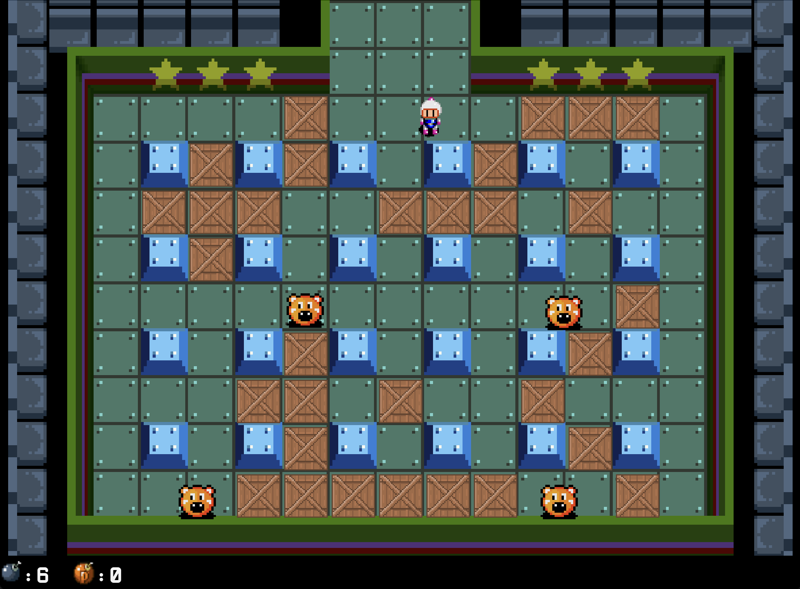

###

<h1 align="left">Yousif Muhammed</h1>

###

<h2 align="left">I craft with</h2>

###

  
  
    
  

###

  
  

###

<h2 align="left">My Projects</h2>

  <h3>Bomberman</h3>
  
  
Developed using Java (Maven), the goal is to eliminate all NPCs. In multiplayer mode, the goal is to be the last player standing. The project has a CICD pipeline, I used Git feature branching for organized code development, and supports peer-to-peer multiplayer gameplay.

###

  <h3>Yogi Bear game</h3>
  
  
This is a platformer game where Yogi bear has to collect baskets while not being detected by the guards.

###

  <h3>Spaceship game</h3>
  
  
This is a two player game, the winner is who sends half of his ships inside the blackhole

###

