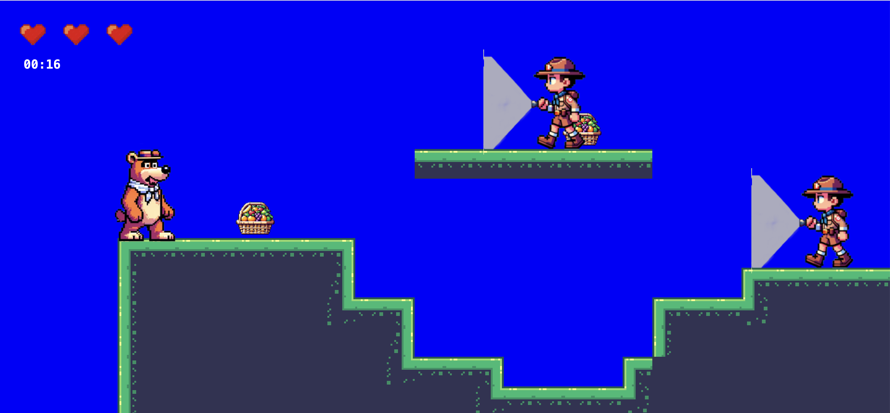

###

<h1 align="left">Yousif Muhammed</h1>

###

<h2 align="left">I craft with</h2>

###

  
  
    
  
  
  
  
  

###

  
  

###

<h2 align="left">My Projects</h2>

###

  <h3>Yogi Bear game</h3>
  
  
This project is a sophisticated calculator that handles complex equations and provides graphical output.

###

  <h3>Weather App</h3>
  
  
A real-time weather application that provides current conditions and forecasts based on your location.

###

